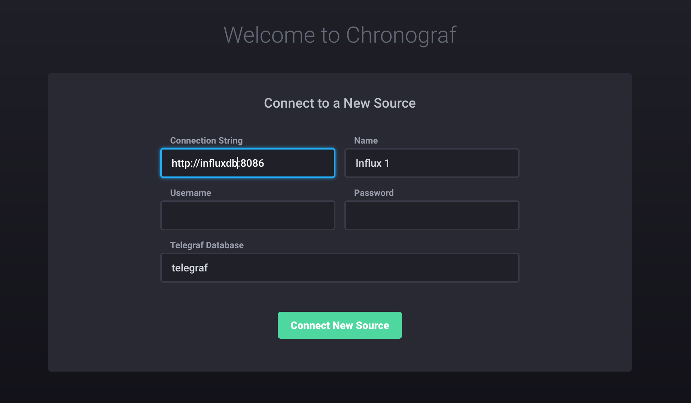
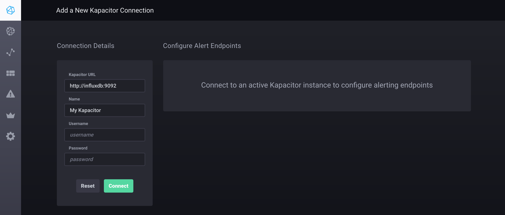

# TICK Sandbox

This repo is a quick way to get the entire TICK Stack spun up and working together. It uses [docker](https://www.docker.com/) to spin up the full TICK stack in a connected fashion. This is heavily tested on Mac and should mostly work on linux.

To get started you need a running docker installation. If you do not have one, go [here and download](https://docs.docker.com/docker-for-mac/install/) the Stable release.

### Running 

To run the `sandbox`, simply use the convinent cli:

```bash
$ ./sandbox
sandbox commands:
  up           -> spin up the sandbox environment
  down         -> tear down the sandbox environment
  delete-data  -> delete all data created by the TICK Stack
  docker-clean -> stop and remove all running docker containers
  
  enter (influxdb||kapacitor||chronograf||telegraf) -> enter the specified container
  logs  (influxdb||kapacitor||chronograf||telegraf) -> stream logs for the specified container
```

To get started just run `./sandbox up`. You browser will open two tabs:

- `localhost:8888` - Chronograf's address. You will use this as a managment UI for the full stack
- `localhost:3000` - Documentation server. This contains a simple markdown server for some tutorials and documentation.

To configure the connection to InfluxDB from Chronograf just fill in `http://influxdb:8086` as the URL:



Once you have configured the InfluxDB URL you should see your dashboard:


Then click on the gear icon and select `Kapacitor`:


Finally, enter `http://kapacitor:9092` as the URL and click `Connect Kapacitor`:



Then you are ready to play with the TICK Stack!